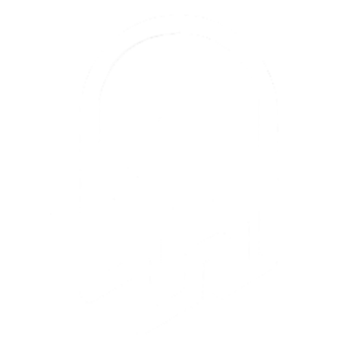
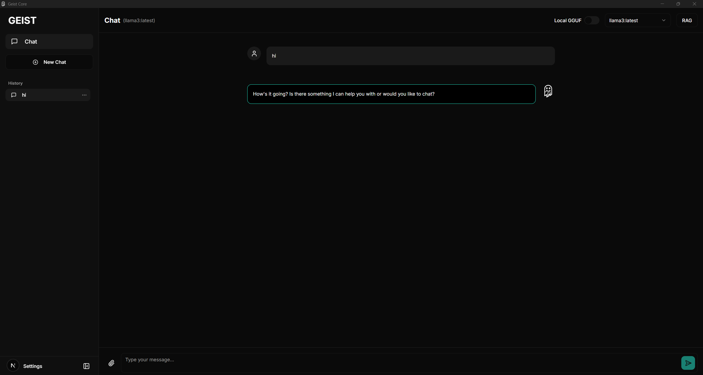

# GEIST CORE

<p align="center">

</p>

### Your Models. Your Data. Your Chat UI.

---

### SO, WHAT IS GEIST CORE?

**Ever wanted a single, powerful chat UI for all your different AI models, but got tired of being locked into someone else's cloud? Me too.**

**That's why I built Geist Core.**

 **I'm a developer and creator who loves tinkering with AI, but I wanted a tool that gave me** **total control**. A place where I could throw a 30GB local GGUF model, hook into my Ollama server, and ping the Gemini API, all from the same interface, without my data ever leaving my machine.

<p align="center">

</p>

**Geist Core is that tool.** **It's the foundational, open-source version of my dream AI chat app, and I'm sharing it with you. This is for all of us who believe in the power of local AI and want a playground to unleash it.**

**This project is, and will always be, open source. It's the blueprint for everything that comes next.**

---

### IMPORTANT NOTES FOR V1.0.0

* **Platform:** **This initial release has been developed and tested primarily on** **Windows 11**. While it may work on other systems, it is not officially supported at this time.
* **Setup:** **This is a guide for running the app from the source code. A simple, one-click installer for users will be available in future releases.**

---

### GETTING STARTED (RUNNING FROM SOURCE)

**This guide will walk you through setting up and running Geist Core from the source code.**

#### STEP 1: CLONE THE REPOSITORY

**First, get the code onto your machine.**

**code**Bash

```
git clone https://github.com/WiredGeist/Geist-Core.git
```

**Then, navigate into the project folder:**

**code**Bash

```
cd Geist-Core
```

#### STEP 2: SET UP THE LLAMA.CPP ENGINE

**Geist Core uses Llama.cpp to run local models. You need to add its files to the project.**

* **Go to the Llama.cpp GitHub releases page:** [https://github.com/ggerganov/llama.cpp/releases](https://www.google.com/url?sa=E&q=https%3A%2F%2Fgithub.com%2Fggerganov%2Fllama.cpp%2Freleases)
* **Download the zip file for your system (e.g.,** **llama-bXXXX-bin-win-cuda-cu12.1.1-x64.zip** **for Windows with NVIDIA).**
* **Extract the contents.**
* **CRITICAL STEP:** **Place the extracted folder inside the** **Geist Core** **project root and rename the folder to** **llama-cpp**. Your project structure must have this folder at the top level, next to **src** **and** **src-tauri**.

#### STEP 3: INSTALL DEPENDENCIES & RUN

**Now, let's get the application running.**

* **Install all the necessary packages:**

  **code**Bash

  ```
  npm install
  ```
* **Run in Development Mode:**
  If you want to debug, modify, or contribute to the code, this is the command for you. It starts the app with hot-reloading and full access to developer tools.

  **code**Bash

  ```
  npm run tauri dev
  ```

  **What happens now?**
  The very first time you run this command, the Tauri CLI is smart. It will check your system for all the required dependencies, like the **Rust toolchain**. If anything is missing, **it will automatically prompt you to install it.** **Just follow the on-screen instructions, and it will handle the rest.**
* **Build the Final Application:**
  If you simply want to build the final, optimized **.exe** **installer to use the application as it is, run this command:**

  **code**Bash 

  ```
  npm run tauri build
  ```

  **This command will compile everything in release mode (optimized for performance) and place the final** **.msi** **installer in the** **src-tauri/target/release/bundle/msi/** **directory. You can then run this installer to use the app.**

#### TROUBLESHOOTING / MANUAL INSTALLS

**If for some reason the automatic setup fails, you can install the dependencies manually:**

* **Node.js:** **Download the LTS version from** [https://nodejs.org/en/download/](https://www.google.com/url?sa=E&q=https%3A%2F%2Fnodejs.org%2Fen%2Fdownload%2F)
* **Rust:** **Install via rustup from** [https://rustup.rs/](https://www.google.com/url?sa=E&q=https%3A%2F%2Frustup.rs%2F)

---

### CONFIGURATION GUIDE

**First things first: you gotta tell Geist Core where your models are. Head over to the** **Settings** **page to get started.**

#### GGUF Models (Local & Offline)

* **Get a Model: Download GGUF models from Hugging Face:** [https://huggingface.co/models](https://www.google.com/url?sa=E&q=https%3A%2F%2Fhuggingface.co%2Fmodels)
* **Add Chat Model: In Settings, go to** **Model Providers > Local GGUF Model Path** **and click "Browse" to select your downloaded GGUF chat model.**
* **Add Embedding Model: For the RAG feature to work, you also need an embedding model. Go to** **RAG Settings** **and browse for a GGUF embedding model. You can find some here:** [https://huggingface.co/models?search=embedding%20gguf](https://www.google.com/url?sa=E&q=https://huggingface.co/models?search=embedding%20gguf)

#### Ollama

* **Install Ollama: If you don't have it, download and install it from the official site:** [https://ollama.com/](https://www.google.com/url?sa=E&q=https%3A%2F%2Follama.com%2F)
* **Get a Model: Pull a model from the Ollama library. For example, you can try my fine-tuned model by opening a terminal and running:**
  ollama run WiredGeist/geistv2
* **Configure Geist Core: In Settings, go to** **Model Providers > Ollama Server Address** **and enter the address of your server (usually** **http://localhost:11434**).
* **Your available Ollama models will now appear in the dropdown menu on the main chat screen.**

#### Google Gemini

* **Get an API Key: If you have a Google account, you can get a free API key to use with the Gemini models.**

  * **Check pricing here:** [https://ai.google.dev/gemini-api/docs/pricing](https://www.google.com/url?sa=E&q=https%3A%2F%2Fai.google.dev%2Fgemini-api%2Fdocs%2Fpricing)
  * **Get your key here:** [https://aistudio.google.com/app/apikey](https://www.google.com/url?sa=E&q=https%3A%2F%2Faistudio.google.com%2Fapp%2Fapikey)
* **Configure Geist Core: In Settings, go to** **Model Providers > API Keys** **and paste your Google AI key into the field.**
* **Available Gemini models will now appear in the chat dropdown.**

---

### THE SETTINGS PANEL EXPLAINED

#### Hardware (Llama.cpp)

**This is where you tune the performance for your local GGUF models.**

* **Hardware (CUDA/CPU):** **Choose whether to use your NVIDIA GPU (CUDA) or just your CPU. Note: If you select CUDA, you** **must** **set the GPU Layers to 1 or more, otherwise it will fall back to CPU.**
* **Threads:** **Number of CPU threads to use for processing. A good starting point is your number of physical CPU cores.**
* **GPU Layers:** **The number of model layers to offload to your GPU. This is the most important setting for performance. More layers = faster, but requires more VRAM.**
* **And many other performance optimizations like** **Context Size**, **Flash Attention**, etc.

**After setting this up, you can use the** **Launch/Stop GGUF Server** **buttons here, or just use the toggle on the main chat screen.**

#### Chat Settings

* **Chat Memory:** **This toggle controls whether the app sends your previous messages in the current conversation as context.**
* **Danger Zone:** **The big red button,** **"Clear All Chat Data,"** **does exactly what it says. This cannot be undone.**

**Remember to hit** **"Save Changes"** **at the bottom after you've configured everything!**

---

### USING THE CHAT INTERFACE

* **The Left Sidebar:** **This is where your chat history lives. Start a new chat, continue an old one, or delete them.**
* **The Top Header:**

  * **Local GGUF Toggle:** **This switch** **only appears after you've set a GGUF model path**. Toggling it on starts the Llama.cpp server.
  * **Model Dropdown:** **This lists all your available Ollama and Google Gemini models.**
  * **RAG Button:** **Click this to open the document manager.**
* **The Message Input:**

  * **The** **paperclip icon** **is another way to upload a text file directly to the chat for RAG.**

---

### THE TECH STACK

* **Framework:** **Tauri (v2)**
* **Backend:** **Rust**
* **Frontend:** **Next.js & React**
* **UI:** **shadcn/ui & Tailwind CSS**
* **State:** **Zustand**

---

### LET'S CONNECT & BUILD TOGETHER

**This is a personal project, but I'm building it for the community. I share tools like this, and my journey building them, on my social channels.**

**If you dig what I'm doing, want to see what's next, or just want to support an indie dev, here's how:**

* **Star the Repo on GitHub:** **This is the best way to show your support and help others discover the project.**
  [https://github.com/WiredGeist](https://www.google.com/url?sa=E&q=https%3A%2F%2Fgithub.com%2FWiredGeist)
* **Follow My Work:** **I post about my projects, AI, and other tech explorations.**
  [https://www.wiredgeist.com/](https://www.google.com/url?sa=E&q=https%3A%2F%2Fwww.wiredgeist.com%2F)
* **Fuel the Next Update (Ko-fi):** **If Geist Core saves you time or you just think it's cool, consider buying me a coffee. It genuinely helps and is massively appreciated!**
  [https://ko-fi.com/wiredgeist](https://www.google.com/url?sa=E&q=https%3A%2F%2Fko-fi.com%2Fwiredgeist)

**Thanks for checking out my project. Let's see what you build with it.**

---

### LICENSE

**MIT License - Go wild.**
